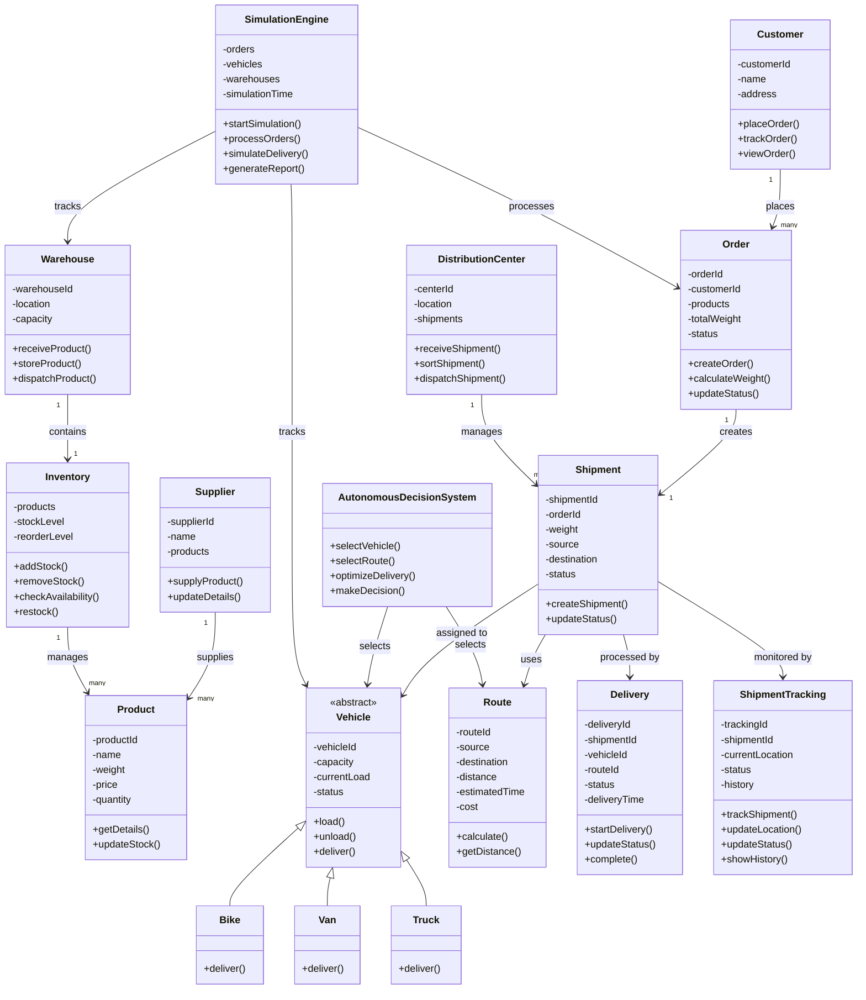
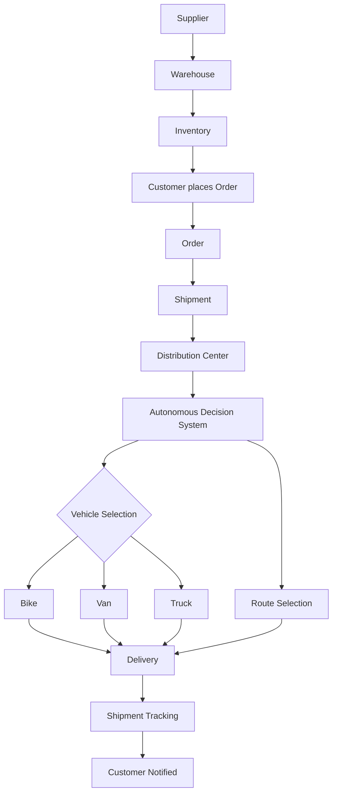

# Autonomous Logistics and Supply Chain Simulation

## System Architecture / Class Diagram

```text
                                    ┌───────────────────────┐
                          # Autonomous Logistics and Supply Chain Simulation

A C++ object-oriented system design for simulating an end-to-end logistics pipeline — from supplier to warehouse, through order and shipment creation, to autonomous vehicle/route selection and final delivery tracking.

---

## Table of Contents

1. [System Overview](#system-overview)
2. [Class Diagram](#class-diagram)
3. [Class Reference](#class-reference)
4. [Class Relationships](#class-relationships)
5. [Main Logistics Flow](#main-logistics-flow)
6. [OOP Concepts Covered](#oop-concepts-covered)
7. [Suggested Project Structure](#suggested-project-structure)

---

## System Overview

The simulation models a full supply chain pipeline in three stages:

| Stage | Classes Involved | Purpose |
|---|---|---|
| **Sourcing & Storage** | `Supplier`, `Product`, `Warehouse`, `Inventory` | Products enter the system and are stocked |
| **Order & Shipment** | `Customer`, `Order`, `Shipment`, `DistributionCenter` | Customer demand is converted into a trackable shipment |
| **Autonomous Delivery** | `AutonomousDecisionSystem`, `Vehicle` (`Bike`/`Van`/`Truck`), `Route`, `Delivery`, `ShipmentTracking` | The system autonomously selects a vehicle and route, then executes and tracks delivery |

A top-level `SimulationEngine` drives the whole process end to end and produces a final report.

---

## Class Diagram



---

## Class Reference

### Sourcing & Storage

| Class | Attributes | Methods |
|---|---|---|
| **Supplier** | `supplierId`, `name`, `products` | `supplyProduct()`, `updateDetails()` |
| **Product** | `productId`, `name`, `weight`, `price`, `quantity` | `getDetails()`, `updateStock()` |
| **Warehouse** | `warehouseId`, `location`, `capacity` | `receiveProduct()`, `storeProduct()`, `dispatchProduct()` |
| **Inventory** | `products`, `stockLevel`, `reorderLevel` | `addStock()`, `removeStock()`, `checkAvailability()`, `restock()` |

### Order & Shipment

| Class | Attributes | Methods |
|---|---|---|
| **Customer** | `customerId`, `name`, `address` | `placeOrder()`, `trackOrder()`, `viewOrder()` |
| **Order** | `orderId`, `customerId`, `products`, `totalWeight`, `status` | `createOrder()`, `calculateWeight()`, `updateStatus()` |
| **Shipment** | `shipmentId`, `orderId`, `weight`, `source`, `destination`, `status` | `createShipment()`, `updateStatus()` |
| **DistributionCenter** | `centerId`, `location`, `shipments` | `receiveShipment()`, `sortShipment()`, `dispatchShipment()` |

### Autonomous Delivery

| Class | Attributes | Methods |
|---|---|---|
| **AutonomousDecisionSystem** | — | `selectVehicle()`, `selectRoute()`, `optimizeDelivery()`, `makeDecision()` |
| **Vehicle** (abstract base) | `vehicleId`, `capacity`, `currentLoad`, `status` | `load()`, `unload()`, `deliver()` |
| **Bike / Van / Truck** | *(inherit from Vehicle)* | `deliver()` *(overridden)* |
| **Route** | `routeId`, `source`, `destination`, `distance`, `estimatedTime`, `cost` | `calculate()`, `getDistance()` |
| **Delivery** | `deliveryId`, `shipmentId`, `vehicleId`, `routeId`, `status`, `deliveryTime` | `startDelivery()`, `updateStatus()`, `complete()` |
| **ShipmentTracking** | `trackingId`, `shipmentId`, `currentLocation`, `status`, `history` | `trackShipment()`, `updateLocation()`, `updateStatus()`, `showHistory()` |

### Orchestration

| Class | Attributes | Methods |
|---|---|---|
| **SimulationEngine** | `orders`, `vehicles`, `warehouses`, `simulationTime` | `startSimulation()`, `processOrders()`, `simulateDelivery()`, `generateReport()` |

---

## Class Relationships

| Relationship | Type |
|---|---|
| Supplier → Product | Supplies |
| Warehouse → Inventory | Composition |
| Inventory → Product | Manages |
| Customer → Order | Places |
| Order → Shipment | Creates |
| DistributionCenter → Shipment | Manages |
| Vehicle → Bike, Van, Truck | Inheritance |
| Shipment → Vehicle | Assigned to |
| Shipment → Route | Uses |
| Shipment → Delivery | Processed by |
| Shipment → ShipmentTracking | Monitored by |
| AutonomousDecisionSystem → Vehicle, Route | Selects |
| SimulationEngine → all components | Orchestrates |

---

## Main Logistics Flow



### Simulation Engine Pipeline

```text
Generate/Receive Order
        ↓
Check Inventory
        ↓
Create Shipment
        ↓
Select Vehicle
        ↓
Select Route
        ↓
Dispatch
        ↓
Simulate Movement
        ↓
Update Tracking
        ↓
Complete Delivery
        ↓
Generate Report
```

---

## OOP Concepts Covered

### 1. Encapsulation
Private attributes accessed only through public methods.
```cpp
class Product {
private:
    int productId;
    string name;
    double price;
public:
    void updateStock(int qty);
};
```

### 2. Inheritance
```text
Vehicle
├── Bike
├── Van
└── Truck
```

### 3. Polymorphism
```cpp
Vehicle* vehicle = new Truck();
vehicle->deliver();   // resolves to Truck's implementation at runtime
```

### 4. Abstraction
`Vehicle` is an abstract base class with pure virtual functions (e.g. `deliver()`), forcing each subclass to provide its own implementation.

### 5. Composition
A "part cannot exist without the whole" relationship:
```text
Warehouse → Inventory
Order → Products
```

### 6. Aggregation
A "has-a" relationship where parts can exist independently:
```text
Company → Suppliers
Company → Customers
Company → Vehicles
```

### 7. Function Overloading
```cpp
createOrder();
createOrder(Product p);
createOrder(Product p, int quantity);
```

### 8. Function Overriding
```cpp
Bike::deliver()
Van::deliver()
Truck::deliver()
```

### 9. Constructors / Destructors
Used to initialize objects (e.g. assign IDs, set default status) and clean up dynamically allocated resources (e.g. vehicle fleets).

### 10. Exception Handling
```text
InsufficientInventoryException
VehicleOverloadedException
InvalidOrderException
InvalidRouteException
WarehouseFullException
```

### 11. STL Usage
```cpp
vector<Product>
vector<Order>
vector<Vehicle*>
map<int, Product>
queue<Order>
priority_queue<Order>
```

### 12. File Handling
Persisted data:
```text
Products
Customers
Orders
Inventory
Vehicles
Shipment History
Simulation Results
```

### 13. Simulation
The `SimulationEngine` owns and drives the full lifecycle described in the pipeline above, coordinating orders, inventory, vehicles, and warehouses over a simulated timeline.

---

## Suggested Project Structure

```text
logistics-simulation/
├── include/
│   ├── Supplier.h
│   ├── Product.h
│   ├── Warehouse.h
│   ├── Inventory.h
│   ├── Customer.h
│   ├── Order.h
│   ├── Shipment.h
│   ├── DistributionCenter.h
│   ├── AutonomousDecisionSystem.h
│   ├── Vehicle.h          // abstract base
│   ├── Bike.h
│   ├── Van.h
│   ├── Truck.h
│   ├── Route.h
│   ├── Delivery.h
│   ├── ShipmentTracking.h
│   └── SimulationEngine.h
├── src/
│   └── (corresponding .cpp files)
├── data/
│   └── (file-handling outputs: orders.txt, inventory.txt, etc.)
└── main.cpp
```          │       SUPPLIER        │
                                    ├───────────────────────┤
                                    │ - supplierId          │
                                    │ - name                │
                                    │ - products            │
                                    ├───────────────────────┤
                                    │ + supplyProduct()     │
                                    │ + updateDetails()     │
                                    └───────────┬───────────┘
                                                │
                                                │ supplies
                                                ▼
                                    ┌───────────────────────┐
                                    │        PRODUCT        │
                                    ├───────────────────────┤
                                    │ - productId           │
                                    │ - name                │
                                    │ - weight              │
                                    │ - price               │
                                    │ - quantity            │
                                    ├───────────────────────┤
                                    │ + getDetails()        │
                                    │ + updateStock()       │
                                    └───────────┬───────────┘
                                                │
                                                │ stored in
                                                ▼
                                    ┌───────────────────────┐
                                    │       WAREHOUSE       │
                                    ├───────────────────────┤
                                    │ - warehouseId         │
                                    │ - location            │
                                    │ - capacity            │
                                    ├───────────────────────┤
                                    │ + receiveProduct()    │
                                    │ + storeProduct()      │
                                    │ + dispatchProduct()   │
                                    └───────────┬───────────┘
                                                │
                                                │ manages
                                                ▼
                                    ┌───────────────────────┐
                                    │       INVENTORY       │
                                    ├───────────────────────┤
                                    │ - products            │
                                    │ - stockLevel          │
                                    │ - reorderLevel        │
                                    ├───────────────────────┤
                                    │ + addStock()          │
                                    │ + removeStock()       │
                                    │ + checkAvailability() │
                                    │ + restock()           │
                                    └───────────┬───────────┘
                                                │
                                                │ fulfills
                                                ▼
                                    ┌───────────────────────┐
                                    │        CUSTOMER       │
                                    ├───────────────────────┤
                                    │ - customerId          │
                                    │ - name                │
                                    │ - address             │
                                    ├───────────────────────┤
                                    │ + placeOrder()        │
                                    │ + trackOrder()        │
                                    │ + viewOrder()         │
                                    └───────────┬───────────┘
                                                │
                                                │ places
                                                ▼
                                    ┌───────────────────────┐
                                    │         ORDER         │
                                    ├───────────────────────┤
                                    │ - orderId             │
                                    │ - customerId          │
                                    │ - products            │
                                    │ - totalWeight         │
                                    │ - status              │
                                    ├───────────────────────┤
                                    │ + createOrder()       │
                                    │ + calculateWeight()   │
                                    │ + updateStatus()      │
                                    └───────────┬───────────┘
                                                │
                                                │ creates
                                                ▼
                                    ┌───────────────────────┐
                                    │       SHIPMENT        │
                                    ├───────────────────────┤
                                    │ - shipmentId          │
                                    │ - orderId             │
                                    │ - weight              │
                                    │ - source              │
                                    │ - destination         │
                                    │ - status              │
                                    ├───────────────────────┤
                                    │ + createShipment()    │
                                    │ + updateStatus()      │
                                    └───────────┬───────────┘
                                                │
                                                ▼
                            ┌─────────────────────────────────┐
                            │      DISTRIBUTION CENTER        │
                            ├─────────────────────────────────┤
                            │ - centerId                      │
                            │ - location                      │
                            │ - shipments                     │
                            ├─────────────────────────────────┤
                            │ + receiveShipment()             │
                            │ + sortShipment()                │
                            │ + dispatchShipment()            │
                            └───────────────┬─────────────────┘
                                            │
                                            ▼
                            ┌─────────────────────────────────┐
                            │   AUTONOMOUS DECISION SYSTEM    │
                            ├─────────────────────────────────┤
                            │ + selectVehicle()               │
                            │ + selectRoute()                 │
                            │ + optimizeDelivery()            │
                            │ + makeDecision()                │
                            └───────────────┬─────────────────┘
                                            │
                              ┌─────────────┴─────────────┐
                              │                           │
                              ▼                           ▼
                    ┌─────────────────┐         ┌─────────────────┐
                    │     VEHICLE     │         │      ROUTE      │
                    ├─────────────────┤         ├─────────────────┤
                    │ - vehicleId     │         │ - routeId       │
                    │ - capacity      │         │ - source        │
                    │ - currentLoad   │         │ - destination   │
                    │ - status        │         │ - distance      │
                    ├─────────────────┤         │ - estimatedTime │
                    │ + load()        │         │ - cost          │
                    │ + unload()      │         ├─────────────────┤
                    │ + deliver()     │         │ + calculate()   │
                    └────────┬────────┘         │ + getDistance() │
                             │                  └─────────────────┘
                    ┌────────┼────────┐
                    │        │        │
                    ▼        ▼        ▼
                ┌───────┐ ┌───────┐ ┌────────┐
                │  Bike │ │  Van  │ │  Truck │
                ├───────┤ ├───────┤ ├────────┤
                │+deliver│ │+deliver│ │+deliver │
                └───────┘ └───────┘ └────────┘
                    │        │        │
                    └────────┼────────┘
                             ▼
                    ┌─────────────────┐
                    │    DELIVERY     │
                    ├─────────────────┤
                    │ - deliveryId    │
                    │ - shipmentId    │
                    │ - vehicleId     │
                    │ - routeId       │
                    │ - status        │
                    │ - deliveryTime  │
                    ├─────────────────┤
                    │ + startDelivery()│
                    │ + updateStatus() │
                    │ + complete()     │
                    └────────┬────────┘
                             │
                             ▼
                    ┌─────────────────────┐
                    │  SHIPMENT TRACKING  │
                    ├─────────────────────┤
                    │ - trackingId       │
                    │ - shipmentId       │
                    │ - currentLocation  │
                    │ - status            │
                    │ - history           │
                    ├─────────────────────┤
                    │ + trackShipment()  │
                    │ + updateLocation() │
                    │ + updateStatus()   │
                    │ + showHistory()    │
                    └─────────────────────┘


                    ┌──────────────────────────┐
                    │    SIMULATION ENGINE     │
                    ├──────────────────────────┤
                    │ - orders                 │
                    │ - vehicles               │
                    │ - warehouses             │
                    │ - simulationTime         │
                    ├──────────────────────────┤
                    │ + startSimulation()      │
                    │ + processOrders()        │
                    │ + simulateDelivery()     │
                    │ + generateReport()       │
                    └──────────────────────────┘
```

---

## Class Relationships

```text
Supplier ───── supplies ───────► Product

Warehouse ─── contains ─────────► Inventory

Inventory ─── manages ──────────► Product

Customer ──── places ───────────► Order

Order ─────── creates ──────────► Shipment

DistributionCenter ─ manages ───► Shipment

Vehicle ◄──── inherits ────────── Bike
Vehicle ◄──── inherits ────────── Van
Vehicle ◄──── inherits ────────── Truck

Shipment ─── assigned to ───────► Vehicle

Shipment ─── uses ──────────────► Route

Shipment ─── processed by ──────► Delivery

Shipment ─── monitored by ──────► ShipmentTracking

AutonomousDecisionSystem ───────► Vehicle

AutonomousDecisionSystem ───────► Route

SimulationEngine ───────────────► Simulation Components
```

---

## Main Logistics Flow

```text
Supplier
   │
   ▼
Warehouse
   │
   ▼
Inventory
   │
   ▼
Customer
   │
   │ places order
   ▼
Order
   │
   ▼
Shipment
   │
   ▼
Distribution Center
   │
   ▼
Autonomous Decision System
   │
   ├──────────────► Vehicle Selection
   │                    │
   │                    ├── Bike
   │                    ├── Van
   │                    └── Truck
   │
   └──────────────► Route Selection
                        │
                        ▼
                      Route
                        │
                        ▼
                     Delivery
                        │
                        ▼
                 Shipment Tracking
                        │
                        ▼
                    Customer
```

---

## OOP Concepts Covered

### 1. Encapsulation

Private attributes inside classes:

```cpp
class Product
{
private:
    int productId;
    string name;
    double price;
};
```

### 2. Inheritance

```text
Vehicle
├── Bike
├── Van
└── Truck
```

### 3. Polymorphism

```cpp
Vehicle *vehicle;

vehicle->deliver();
```

The behavior can differ for `Bike`, `Van`, and `Truck`.

### 4. Abstraction

`Vehicle` can be an abstract base class with virtual functions.

### 5. Composition

Examples:

```text
Warehouse → Inventory
Order → Products
```

### 6. Aggregation

Examples:

```text
Company → Suppliers
Company → Customers
Company → Vehicles
```

### 7. Function Overloading

Different versions of functions such as:

```cpp
createOrder()
createOrder(Product p)
createOrder(Product p, int quantity)
```

### 8. Function Overriding

```cpp
Bike::deliver()
Van::deliver()
Truck::deliver()
```

### 9. Constructors / Destructors

Used to initialize and clean up objects.

### 10. Exception Handling

Examples:

```text
Insufficient Inventory
Vehicle Overloaded
Invalid Order
Invalid Route
Warehouse Full
```

### 11. STL

Potentially:

```cpp
vector<Product>
vector<Order>
vector<Vehicle*>
map<int, Product>
queue<Order>
priority_queue<Order>
```

### 12. File Handling

Store:

```text
Products
Customers
Orders
Inventory
Vehicles
Shipment History
Simulation Results
```

### 13. Simulation

The `SimulationEngine` controls the complete flow:

```text
Generate/Receive Order
        ↓
Check Inventory
        ↓
Create Shipment
        ↓
Select Vehicle
        ↓
Select Route
        ↓
Dispatch
        ↓
Simulate Movement
        ↓
Update Tracking
        ↓
Complete Delivery
        ↓
Generate Report
```
